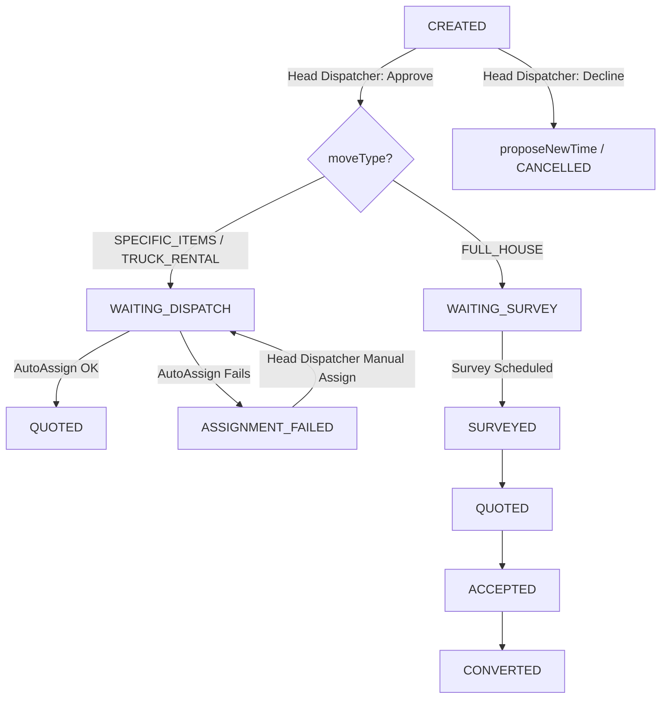

# Hybrid Dispatcher Flow: Approval + Smart Assignment

## Overview

Implement a **hybrid routing architecture** where:
- All tickets land at the **Head Dispatcher** for business approval first
- Post-approval, tickets are **automatically routed** by move type:
  - `FULL_HOUSE` → Survey process → `WAITING_SURVEY`
  - `SPECIFIC_ITEMS` / `TRUCK_RENTAL` → Direct assignment → `WAITING_DISPATCH`
- Assignment is **system-automated** with district-based load-balancing, cascading fallbacks to nearby dispatcher, then Head Dispatcher
- The `Xác nhận` button **always calls `POST /api/request-tickets/:id/approve`** — the smart endpoint that branches by `moveType`

| Concern | Owner |
|---|---|
| Validation / business approval | Head Dispatcher (manual) |
| Assignment / load balancing | System (auto) + fallback |

---

## User Review Required (All Confirmed ✅)

> [!NOTE]
> `ASSIGNMENT_FAILED` added to status enum. Customer-facing display is **hidden** — notify customer separately later (⚠️ **reminder: add customer notification for `ASSIGNMENT_FAILED` in a future task**).

> [!NOTE]
> Visual separation of moveTypes in `SurveySchedulingPage` via colored badges + **filter buttons** by moveType. Badge color palette confirmed as the app's green palette.

> [!NOTE]
> Load limits: `SOFT_LIMIT = 5`, `HARD_LIMIT = 10`. Exceeding SOFT triggers least-loaded preference; exceeding HARD triggers escalation.

---

## Proposed Changes

### Backend — Model

#### [MODIFY] [RequestTicket.js](file:///d:/Works/PJ/SP26/SEP490/HOMS_BE/src/models/RequestTicket.js)
- Add `ASSIGNMENT_FAILED` to the `status` enum (for auto-assignment fallback tracking).

---

### Backend — Strategies (State Transitions)

#### [MODIFY] [ItemMovingStrategy.js](file:///d:/Works/PJ/SP26/SEP490/HOMS_BE/src/services/strategies/itemMoving/ItemMovingStrategy.js)
- Replace current transitions (which incorrectly allow `WAITING_SURVEY`) with:
  ```
  CREATED → WAITING_DISPATCH | CANCELLED
  WAITING_DISPATCH → QUOTED | ASSIGNMENT_FAILED | CANCELLED
  ASSIGNMENT_FAILED → WAITING_DISPATCH | CANCELLED  (fallback to head dispatcher)
  QUOTED → ACCEPTED | CANCELLED
  ACCEPTED → CONVERTED | CANCELLED
  ```

#### [MODIFY] [TruckRentalStrategy.js](file:///d:/Works/PJ/SP26/SEP490/HOMS_BE/src/services/strategies/truckRental/TruckRentalStrategy.js)
- Same the same transitions as `ItemMovingStrategy`.

#### [MODIFY] [FullHouseStrategy.js](file:///d:/Works/PJ/SP26/SEP490/HOMS_BE/src/services/strategies/fullHouse/FullHouseStrategy.js)
- Keep existing transitions, no change needed.

---

### Backend — Auto-Assignment Service

#### [NEW] [AutoAssignmentService.js](file:///d:/Works/PJ/SP26/SEP490/HOMS_BE/src/services/AutoAssignmentService.js)
- Core assignment logic with cascading fallback:
  1. Find dispatcher with `workingAreas` matching `pickup.district` and load `< SOFT_LIMIT (5)`
  2. If none found: find any dispatcher (any area) with load `< SOFT_LIMIT`
  3. If none found: pick least-loaded dispatcher with load `< HARD_LIMIT (10)`
  4. If all exceed `HARD_LIMIT`: return `null` → ticket set to `ASSIGNMENT_FAILED`, notify Head Dispatcher
- Methods: `assignDispatcher(ticket)`, `findBestDispatcher(district)`
- Counts "active tickets" as tickets in statuses: `WAITING_DISPATCH`, `WAITING_SURVEY`, `SURVEYED`, `QUOTED`

---

### Backend — requestTicketService

#### [MODIFY] [requestTicketService.js](file:///d:/Works/PJ/SP26/SEP490/HOMS_BE/src/services/requestTicketService.js)
- Add `approveTicket(ticketId, userId)` method:
  - Head Dispatcher action on a `CREATED` ticket
  - For `FULL_HOUSE`: transition to `WAITING_SURVEY`, create survey scheduling notification
  - For `SPECIFIC_ITEMS` / `TRUCK_RENTAL`: transition to `WAITING_DISPATCH`, trigger `AutoAssignmentService.assignDispatcher(ticket)`
  - If auto-assignment fails: mark as `ASSIGNMENT_FAILED`, notify Head Dispatcher

---

### Backend — requestTicketController

#### [MODIFY] [requestTicketController.js](file:///d:/Works/PJ/SP26/SEP490/HOMS_BE/src/controllers/requestTicketController.js)
- Add `approveTicket` controller endpoint:
  ```
  POST /api/request-tickets/:id/approve
  ```
  - Role-guarded to `dispatcher` (head dispatcher)

---

### Backend — Router

#### [MODIFY] requestTicket router file
- Register the new `POST /request-tickets/:id/approve` route.

---

### Frontend — FE Service

#### [MODIFY] [surveysService.js](file:///d:/Works/PJ/SP26/SEP490/HOMS_FE/src/services/surveysService.js)
- Add `approveTicket(ticketId)` to `requestTicketService`.

---

### Frontend — SurveySchedulingPage

#### [MODIFY] [SurveySchedulingPage.jsx](file:///d:/Works/PJ/SP26/SEP490/HOMS_FE/src/pages/DispatcherPage/SurveySchedulingPage.jsx)

**1. Move Type Badge (new column `Loại dịch vụ`):**
- `FULL_HOUSE` → badge color `#44624a` (dark green) — label "Chuyển nhà"
- `SPECIFIC_ITEMS` → badge color `#8ba888` (medium green) — label "Đồ vật lẻ"
- `TRUCK_RENTAL` → badge color `#c0cfb2` (light green, dark text) — label "Thuê xe"

**2. Filter buttons (above the table):**
- Buttons: `Tất cả` | `Chuyển nhà` | `Đồ vật lẻ` | `Thuê xe`
- Styled using the app's green palette, active state highlighted with `#44624a`
- Filters the table client-side (or re-fetches with `moveType` param)

**3. Conditional `Yêu cầu khảo sát` column:**
- `FULL_HOUSE`: show existing survey date/time + type tag
- `SPECIFIC_ITEMS` / `TRUCK_RENTAL`: show a neutral badge "Tự động điều phối"

**4. Action buttons — split by move type and status:**
- **All `CREATED` tickets**: show **"Duyệt đơn"** button → calls `POST /approve`
  - `FULL_HOUSE`: opens existing surveyor-selection modal first → payload includes surveyorId → approve transitions to `WAITING_SURVEY`
  - `SPECIFIC_ITEMS` / `TRUCK_RENTAL`: direct approval (no modal) → approve transitions to `WAITING_DISPATCH` + auto-assign triggers
- **All `CREATED` tickets**: keep existing **"Từ chối"** button → calls `propose-time` (opens reschedule modal)
- **`ASSIGNMENT_FAILED` tickets**: show **"Phân công thủ công"** button (manual fallback for head dispatcher)

**5. Status map additions:**
- `WAITING_DISPATCH` → yellow badge "Chờ điều phối"
- `ASSIGNMENT_FAILED` → red badge "Lỗi phân công"

**6. Fetch query update:**
- Include `CREATED,WAITING_SURVEY,WAITING_DISPATCH,ASSIGNMENT_FAILED` in status filter

---

## Status Flow Summary



---

## Open Questions — All Resolved ✅

| # | Question | Answer |
|---|---|---|
| 1 | `ASSIGNMENT_FAILED` customer visibility | Dispatcher-only. Add customer notification later. |
| 2 | Auto-assignment district matching | District match first → global fallback → head dispatcher |
| 3 | Router file location | `SEP490/HOMS_BE/src/routes/requestTicketRoutes.js` |
| 4 | Xác nhận button uses `/approve`? | **Yes** — for all types. FULL_HOUSE opens modal first, then `/approve` with surveyor payload. SPECIFIC_ITEMS/TRUCK_RENTAL direct call. |

---

## Verification Plan

### Backend
- Test `POST /api/request-tickets/:id/approve` with a `FULL_HOUSE` ticket → expect `WAITING_SURVEY`
- Test with `SPECIFIC_ITEMS` → expect `WAITING_DISPATCH` + dispatcher auto-assigned
- Test auto-assignment district match hit → correct dispatcher assigned
- Test all dispatchers over HARD_LIMIT → `ASSIGNMENT_FAILED`

### Frontend
- Verify `moveType` badge appears with correct colors on all rows
- Verify filter buttons work correctly
- Verify survey column shows "Tự động điều phối" for non-FULL_HOUSE
- Verify FULL_HOUSE "Duyệt đơn" opens modal before calling `/approve`
- Verify SPECIFIC_ITEMS/TRUCK_RENTAL "Duyệt đơn" calls `/approve` directly
- Verify `ASSIGNMENT_FAILED` rows show manual fallback button
